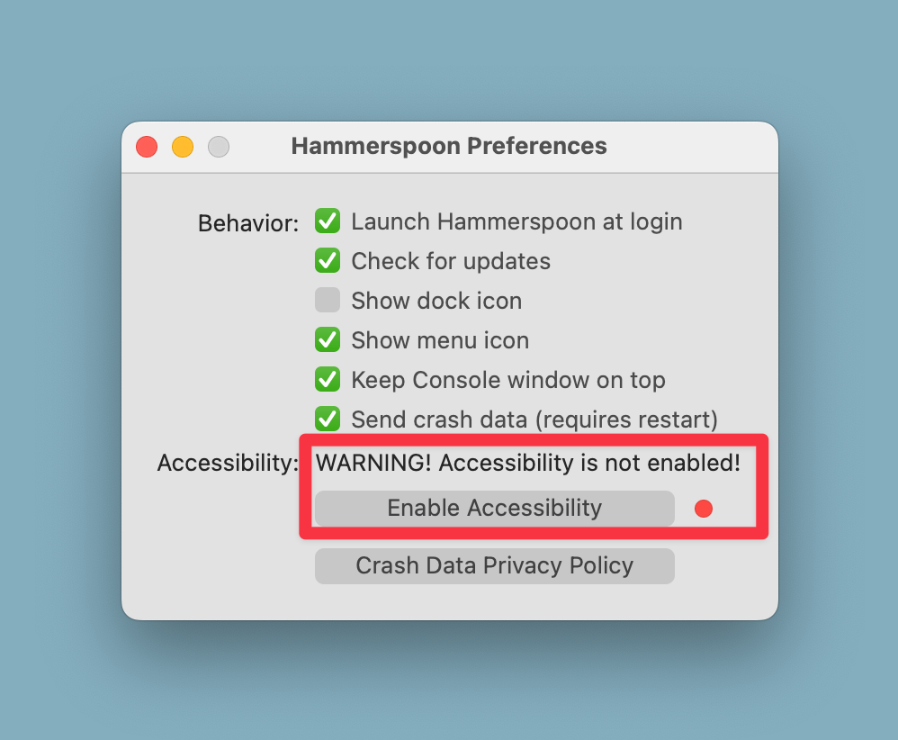

# LG TV Control for macOS

Automatically wake/sleep and change the input of your LG TV when used as a monitor on macOS.

This script uses Hammerspoon to detect system events such as power off, sleep, and wake.

## Requirements

- [Hammerspoon](https://www.hammerspoon.org/)
  - 
- Python 3
- [LGWebOSRemote](https://github.com/klattimer/LGWebOSRemote) (version 2023-01-27 or newer)

### Installing Requirements

This assumes that you already have [Homebrew](https://brew.sh) installed. If you don't, get it first.

## Installing Hammerspoon

```sh
brew install --cask hammerspoon
```

### Installing Python & LGWebOSRemote

```sh
# You can skip this if you already have Python installed and know what you're doing.
brew install python

# Then install LGWebRemote (version 2023-01-27 or newer)...
mkdir -p ~/opt
python -m venv ~/opt/lgtv
cd ~/opt/lgtv
source bin/activate
pip install git+https://github.com/klattimer/LGWebOSRemote
```

### Configuring LGWebOSRemote

By now, you should be able to run

```sh
lgtv scan ssl
lgtv --ssl scan
```

and see some info about your TV. Grab your TV's IP address from the output. Then:

```sh
lgtv auth <ip_address_here> MyTV ssl
```

and follow the instructions on your TV.

Now, try the following:

```sh
lgtv MyTV swInfo ssl
lgtv --name LGC1 --ssl swInfo

# lgtv MyTV screenOff ssl
lgtv --name LGC1 --ssl volumeDown
lgtv --name LGC1 --ssl volumeUp
```
If everything is working as expected, your screen should turn off.

## Installing the Hammerspoon script

1. Copy `lgtv_init.lua`from this repo to `~/.hammerspoon`
2. Run the following

```sh
mkdir -p ~/.hammerspoon
touch ~/.hammerspoon/init.lua
echo "require \"lgtv_init\"" >> ~/.hammerspoon/init.lua
```

3. Change the HDMI input at the top of the Lua script, if needed.


## Special Thanks

Thanks to [@greyshi](https://github.com/greyshi) for extending upon my [initial Wake On LAN gist](https://gist.github.com/cmer/bd40d9da0055d257c5aab2e0143ee17b) and introducing LGWebOSRemote.


# Developing
## Modifying the Hammerspoon script

[Learn Lua](https://learnxinyminutes.com/docs/lua/)
## More `lgtv` command examples

Here are some more useful `lgtv` commands. Notice that some commands requires the `ssl` parameters, and that its position varies. 
```sh
# Volume commands
lgtv MyTV volumeUp
lgtv MyTV volumeDown
lgtv MyTV setVolume ssl 10

# List input IDs
lgtv MyTV listInputs
lgtv MyTV listInputs | jq '.payload.devices' | sed -E 's/^null//g' | jq '.[]'
lgtv MyTV listInputs | jq '.payload.devices' | sed -E 's/^null//g' | jq '.[] | .id'
# Switch to HDMI_1 input
lgtv MyTV setInput ssl HDMI_1

# List app ids
lgtv MyTV listApps | jq '.payload.apps' | sed -E 's/^null//g' | jq '.[] | .id'
# Switch to HDMI1 "app"
lgtv MyTV startApp ssl com.webos.app.hdmi1
# Switch to Home app
lgtv MyTV startApp ssl com.webos.app.home
# Switch to Apple TV app
lgtv MyTV startApp ssl com.apple.appletv
```


```sh
lgtv --name LGC1 --ssl on
lgtv --name LGC1 --ssl screenOn
lgtv --name LGC1 --ssl listApps
lgtv --name LGC1 --ssl startApp com.webos.app.hdmi4

```