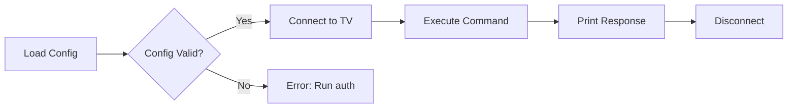
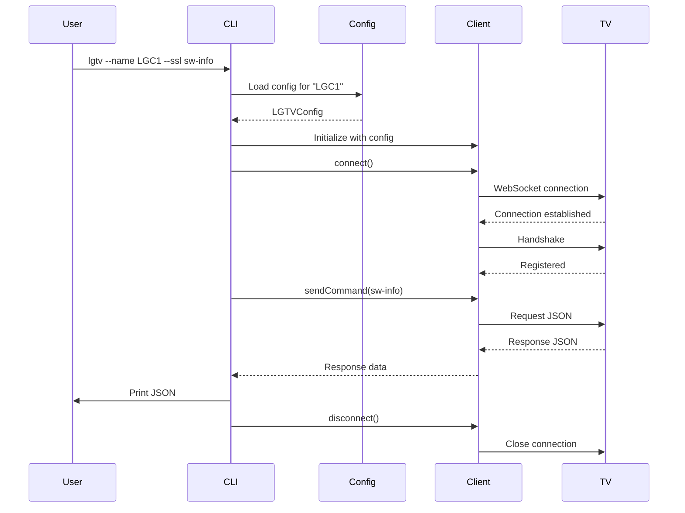

# Using the CLI

Learn how to use the lgtv command-line tool to control your LG webOS TV.

## Overview

The `lgtv` command-line tool provides a Swift-based interface for controlling LG webOS televisions. It replicates the functionality of the Python `lgtv` tool with native Swift performance.

## Installation

Build and install the tool using Swift Package Manager:

```bash
cd swift
swift build -c release
cp .build/release/lgtv /usr/local/bin/
```

## First Time Setup

Before using the CLI, you need to pair with your TV (authentication flow to be implemented).

## Basic Usage Pattern



## Command Reference

### Information Commands

Get information about your TV:

```bash
# Software information
lgtv --name LGC1 --ssl sw-info

# Current app
lgtv --name LGC1 --ssl get-foreground-app-info

# List all installed apps
lgtv --name LGC1 --ssl list-apps

# List available inputs
lgtv --name LGC1 --ssl list-inputs
```

### Volume Control

Adjust audio settings:

```bash
# Increase volume
lgtv --name LGC1 --ssl volume-up

# Decrease volume
lgtv --name LGC1 --ssl volume-down

# Set specific volume level (0-100)
lgtv --name LGC1 --ssl set-volume 25

# Mute/unmute
lgtv --name LGC1 --ssl mute true
lgtv --name LGC1 --ssl mute false
```

### Power Control

Manage TV power state:

```bash
# Turn TV off
lgtv --name LGC1 --ssl off

# Turn screen off (audio continues)
lgtv --name LGC1 --ssl screen-off

# Turn screen on
lgtv --name LGC1 --ssl screen-on

# Turn TV on (Wake-on-LAN, requires MAC address)
lgtv --name LGC1 on
```

### Input and App Control

Switch inputs and launch apps:

```bash
# Switch to HDMI input
lgtv --name LGC1 --ssl set-input HDMI_1

# Launch an app
lgtv --name LGC1 --ssl start-app com.webos.app.hdmi1
lgtv --name LGC1 --ssl start-app com.apple.appletv
```

## Command Flow



## Output Format

All commands return JSON responses from the TV:

```json
{
    "type": "response",
    "id": "1",
    "payload": {
        "returnValue": true,
        "product_name": "webOSTV 6.0",
        "model_name": "HE_DTV_W21O_AFABATAA",
        "sw_type": "FIRMWARE",
        "major_ver": "03",
        "minor_ver": "40.87"
    }
}
```

## Configuration File

The CLI reads from `~/.lgtv/lgtv/config/config.json`:

```json
[
  {
    "name": "LGC1",
    "ip": "192.168.1.100",
    "hostname": "lg-tv.local",
    "mac": "AA:BB:CC:DD:EE:FF",
    "client-key": "abc123def456"
  }
]
```

## Error Handling

Common errors and solutions:

### Configuration Not Found

```
Error: Configuration not found for TV 'LGC1'. Please run auth first.
```

**Solution**: Run the auth command to pair with your TV (to be implemented).

### Connection Failed

```
Error: Unable to connect to TV
```

**Solutions**:
- Verify the TV is powered on
- Check IP address in config
- Ensure TV and computer are on same network
- Try with/without --ssl flag

### MAC Address Required

```
Error: MAC address is required for Wake-on-LAN
```

**Solution**: Add the TV's MAC address to the configuration file.

## Differences from Python Tool

The Swift port maintains command compatibility but has some differences:

| Feature | Python | Swift |
|---------|--------|-------|
| Command names | snake_case | kebab-case |
| SSL flag position | Varies | Always `--ssl` |
| Auth flow | Implemented | To be implemented |
| Wake-on-LAN | Implemented | To be implemented |

## Tips and Best Practices

### Using Aliases

Create shell aliases for common commands:

```bash
alias tv-on="lgtv --name LGC1 on"
alias tv-off="lgtv --name LGC1 --ssl off"
alias tv-vol-up="lgtv --name LGC1 --ssl volume-up"
alias tv-vol-down="lgtv --name LGC1 --ssl volume-down"
```

### Piping Output

Process JSON responses with `jq`:

```bash
# Extract just the model name
lgtv --name LGC1 --ssl sw-info | jq '.payload.model_name'

# Get list of app IDs
lgtv --name LGC1 --ssl list-apps | jq '.payload.apps[].id'

# Find HDMI inputs
lgtv --name LGC1 --ssl list-inputs | jq '.payload.devices[] | select(.id | startswith("HDMI"))'
```

### Scripting

Use in shell scripts for automation:

```bash
#!/bin/bash
# Turn on TV and switch to Apple TV

lgtv --name LGC1 on
sleep 5  # Wait for TV to boot
lgtv --name LGC1 --ssl start-app com.apple.appletv
```

## See Also

- ``LGTVControllerCLI``
- [LGTVWebOSController](../LGTVWebOSController/documentation/lgtvweboscontroller)
